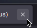

# FireFix

Small fixes for the FireFox UI to make it more consistant

## Features

### Container tab color

_To disable, open `userChrome.css` and remove section 1_

### Correctly space the close tab button

_To disable, open `userChrome.css` and remove section 2_

### Subtle extension tab

_To disable, open `userChrome.css` and remove section 3_

### Remove pinned tab weird spacing

_To disable, open `userChrome.css` and remove section 4_

### Remove spacing in front of tabs

_To disable, open `userChrome.css` and remove section 5_

### Remove one-time-search options

_To disable, open `userChrome.css` and remove section 6_

### Context menu consistency (WIP)

_To disable, open `userChrome.css` and remove section 7_

### Thin scrolbars

_To disable, open `userContent.css` and remove section 1_

## Install

1. Download this project with the `Code` button at the top.
2. Go to `about:support` in your URL bar.
3. Click on the `Open folder` button at the Profile Folder section.
4. Copy the `chrome` folder from the project into your profile folder.
5. Restart FireFox.
